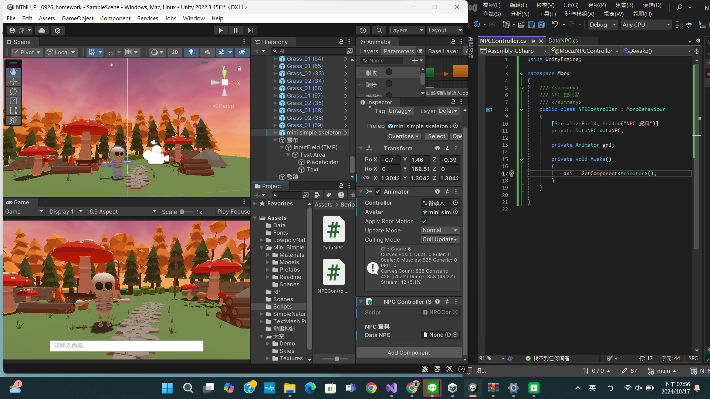

# 程式語言

 - 授課教師：蔡芸琤老師/KID老師
 - 姓名：邱鈺婷
 - 系級：科技系116

# 作業繳交區
## unity作業成果
| [作業展示](https://github.com/MocuAcqu/NTNU_PL_0926_homework) | 此為本次作業的unity資料與程式碼。 |
|--|--|

## HW1

| [成果照片](https://drive.google.com/file/d/1CVwlXwwnlaZvRfEUGnFwszrKWjIFIdE8/view?usp=sharing) |  |
|--|--|

本次作業讓我們在unity上建立專案，並嘗試去抓場景素材、套上材質，設計一個自己的場景介面並截圖。

## HW2

[成果影片](https://youtu.be/gkp_M96XSqE)

本次作業讓我們安裝URP、加入角色素材，進行角色設定，並結合動畫控制器，影片呈現了我創建的一個角色，並且連接五個動畫，成功呼叫的成果。

## HW3

| [成果照片](https://drive.google.com/file/d/1UHg8L2vZCrx2vsOUCPoIdFJdK8U9IY0A/view?usp=sharing) |  |
|--|--|

本次作業在讓我們進行遊戲介面與Hugging face API的串接設定，截圖展現了基於作業二的場景、角色、動畫設定，新增了文字輸入欄位介面、添加字體、建立NPC資料、建立NPC控制器。

## 專題繳交區
### 成果展示
| [程式碼](https://github.com/MocuAcqu/NTNU_PL_Library) | [解說影片](https://youtu.be/Xl6CxgXtN0w) |
 |--|--|

### 圖片展示
 |  |  |  |
 |--|--|--|
